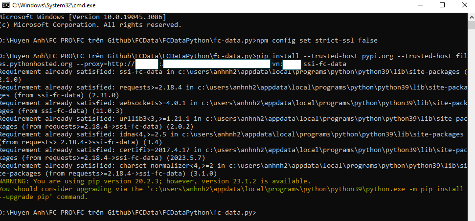

# Hướng dẫn chung


SSI hỗ trợ môi trường Python và NodeJS


## 1. Quy trình tích hợp

Để tích hợp FastConnect Data, khách hàng cần đến các chi nhánh/ PGD của SSI hoặc đăng ký từ xa qua đường bưu điện/ nhân viên môi giới để đăng ký sử dụng dịch vụ FastConnect API.

### 1.1. Đăng ký dịch vụ

\-          Để tích hợp API FastConnect Data cần:

\+ Iboard:

Bước 1: Khách hàng đến các chi nhánh/PGD của SSI hoặc đăng ký từ xa qua đường bưu điện/ nhân viên môi giới để đăng ký sử dụng dịch vụ FastConnect API.

Bước 2: Sau khi đăng ký thành công, hệ thống sẽ gửi email đến người dùng và giao diện trên Iboard

Màn hình hiển thị đã đăng ký dịch vụ thành công:

&#x20;.png>)

Màn hình thông tin dịch vụ đã đăng ký:

&#x20; .png>)  &#x20;

Bước 3: Tạo Key kết nối để sử dụng dịch vụ:

.png>)

Key kết nối được tạo thành công:

.png>)

Bước 4: Lấy ConsumerID và ConsumerSecret thay vào file config: config.py (file trong thư mục giải nén khi tải client Python hoặc NodeJS Fastconnect Data)

Ví dụ đối với client Python:

.png>)

.png>)

Bước 5: Lưu thông tin

## 2.  Thông tin tích hợp

### 2.1. Python Client

#### 2.1.1.   Cài đặt

\-          Yêu cầu cài đặt Python 3.x trở lên (có thể tải bản python.org/downloads/release/python-370/)


**Lưu ý**: Nhớ tick Add system path khi setup Python


\-          Khi cài đặt không sử dụng phiên bản Python mới nhất

Ví dụ: Nếu phiên bản 3.9 là bản mới nhất thì tải bản 3.8 đồ về bản 3.0

\-          Tải client và giải nén:

.png>)

Bước 1: Giải nén

.png>)

Bước 2: Gõ cmd vào ô địa chỉ thư mục để khởi tạo command line

.png>)

Màn hình hiển thị cửa sổ như sau:

.png>)

Bước 3: Cài đặt Client

Chạy câu lệnh

```
pip install dist/<tenthumuc>
```

Ví dụ như ảnh

.png>)

_Đối với Khách hàng là nhân viên và dùng mạng nội bộ SSI_

Bước 3.1. Chạy câu lệnh&#x20;

<pre><code><strong>npm config set strict-ssl false
</strong></code></pre>

Bước 3.2. Chạy 2 câu lệnh&#x20;

```
pip install --trusted-host pypi.org --trusted-host
files.pythonhosted.org --proxy=http://<username>:<password>@<host>:<port> ssi-fc-data

hoặc 
pip install --trusted-host pypi.org --trusted-host
files.pythonhosted.org --proxy=http://<username>:<password>@<host>:<port> dist/<tenthumuc>
```


**Lưu ý**:&#x20;

\+ username và password ( không có ký tự) đăng nhập tài khoản tại SSI.

\+ Nếu password có @ -> Chuyển thành %40


Ví dụ như ảnh



Bước 3.3. Chạy tiếp câu lệnh&#x20;

```
pip install dist/<tenthumuc>
```

Bước 4. Giải nén Client thành công

Ví dụ như ảnh

.png>)

#### 2.1.2.   Chạy Client

Để thuận tiện cho việc test dữ liệu từ Client, người dùng có thể sử dụng thông tin được điền sẵn (có thể sửa đổi) trong file  test\_Req\_Res.py.

Bước 1: Mở file test\_Req\_Res.py (bằng Notepad ++…) và nhập thông tin cần kiểm tra

.png>)

Bước 2: Chạy các API theo file test\_Req\_Res.py với câu lệnh: python \<tên file muốn chạy>

Bước 3: Nhập input cho hàm cần truy vấn từ số 11 -> 18

Ví dụ như ảnh

.png>)

#### 2.1.3.   Streaming Market data

Bước 1: Chạy file test\_Streaming.py bằng câu lệnh: python test\_Streaming.py

Bước 2: Nhập kênh streaming là 1 trong các giá trị:&#x20;

ALL: All channels

F: Securities Status

X: Market data

R: Foreign Room

MI: Index data

B: RealTime Bar (Ohlc Information)


Lưu ý: Mô tả từng kênh Streaming chi tiết tại mục [2. Streaming FastConnect Data](danh-sach-cac-ham.md#2.-streaming-fastconnect-data)


Ví dụ check Streaming VN30 -> Nhập thông tin: MI:VN30

.png>)


**Lưu ý:** Khi nhập kênh Streaming là ALL -> Dữ liệu trả ra sẽ chậm do phải query lượng data lớn


### 2.2.       NodeJS Client

#### 2.2.1.   Cài đặt

\-          Máy tính có cài đặt NodeJS ( cài đặt từ bản v.10.15.3 trở lên)

\-          Kiểm tra máy tính đã cài đặt NodeJS và version: cmd node –version

.png>)

\-          Tải client và giải nén

.png>)

Bước 1: Giải nén

.png>)

Bước 2: Gõ cmd vào ô địa chỉ thư mục để khởi tạo command line

.png>)

Màn hình hiển thị cửa sổ như sau:

.png>)

Bước 3: Cài đặt Client

Chạy câu lệnh

```
npm install ssi-fcdata
```

Màn hình trả hết quả như ảnh

.png>)

_Đối với Khách hàng là nhân viên và dùng mạng nội bộ SSI_

Chạy 2 câu lệnh&#x20;

```
npm config set strict-ssl false
npm install --proxy http://<username>:<password>@<host>:<port> ssi-fctrading
```


**Lưu ý**:&#x20;

\+ username và password ( không có ký tự) đăng nhập tài khoản tại SSI.

\+ Nếu password có @ -> Chuyển thành %40


Ví dụ như ảnh sau:

.png>)

Bước 4: Khi chạy xong tiếp tục gõ câu lệnh

```
npm install ssi-fcdata
```

Ví dụ như ảnh:&#x20;

.png>)

Bước 5: Tiếp tục gõ câu lệnh: node main.js -> Enter&#x20;

Giải nén Client thành công như ảnh

.png>)

#### 2.2.2.   Chạy Client

\-          Để thuận tiện cho việc test dữ liệu từ Client, người dùng có thể sử dụng thông tin được điền sẵn trong file  main.js.

\-          Lấy Key được tạo ở Iboard thay vào file config.js và chạy lại cmd như sau:

Bước 1: Tạo Key ở IBoard

.png>)

Bước 2: Thay ConsumerID và ConsumerSecret vào file config.js

.png>)

Trong đó:

\+ id = ConsumerID

\+ priKey = ConsumerSecret

\-> Lưu file config.js

Bước 3: Mở cmd và chạy lại câu lệnh: ctrl C -> node main.js

.png>)

Bước 4: Giải nén và Cài đặt client thành công

.png>)

Bước 5: Điền thông tin hàm muốn truy vấn ở file main.js

Bước 6: Lưu file và chạy lại câu lệnh node main.js ở cmd

Bước 7: Vào trình duyệt và gõ câu lệnh: http://localhost:\<porthienthitrongcmd>/\<tenhamtruyvan>

Bước 8: Kiểm tra thông tin truy vấn

Ví dụ: Lấy thông tin Get Securities

\-          Điền thông tin muốn truy vấn ở hàm Securities trong file main.js -> Save

.png>)

\-          Mở trình duyệt và chạy câu lệnh: [http://localhost:3020/Securities](http://localhost:3020/Securities)

.png>)

#### 2.2.3.   Streaming Market data

Bước 1: Gõ cmd vào ô địa chỉ thư mục để khởi tạo command line

.png>)

Bước 2: Hiển thị màn hình cmd như ảnh

.png>)

Bước 3: Vào file main.js xuống dòng 183 điền kênh muốn truy vấn -> Save

.png>)

Bước 4: Mở cmd và Điền câu lệnh: npm start

.png>)
